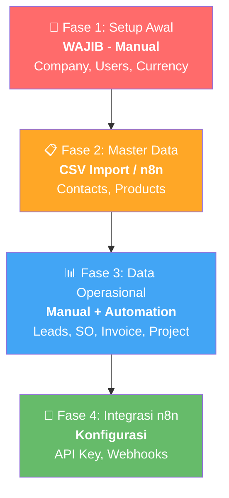

# Data yang Perlu Diinput ke Odoo 19 — Berdasarkan Analisis Source Code

## Overview

Berdasarkan analisis model di `odoo19_src/`, berikut data yang perlu diinput, diurutkan berdasarkan **prioritas dan dependensi**.

---

## Fase 1: Setup Awal (WAJIB, Manual via UI)

> Data fondasi yang harus disetup pertama kali. Hanya perlu dilakukan 1x.

### 1.1 Company (`res.company`)

**Source:** [res_company.py](file:///d:/ProjectAI/Odoo/odoo19_src/odoo/addons/base/models/res_company.py)

| Field | Required | Contoh |
|---|:---:|---|
| [name](file:///d:/ProjectAI/Odoo/odoo19_src/odoo/service/db.py#384-406) | ✅ | Seriaflow |
| [currency_id](file:///d:/ProjectAI/Odoo/odoo19_src/odoo/addons/base/models/res_company.py#30-32) | ✅ | IDR (Indonesian Rupiah) |
| [country_id](file:///d:/ProjectAI/Odoo/odoo19_src/odoo/addons/base/models/res_partner.py#581-585) | 📌 | Indonesia |
| [street](file:///d:/ProjectAI/Odoo/odoo19_src/odoo/addons/base/models/res_company.py#129-132) | — | Jl. Sudirman No. 1 |
| [city](file:///d:/ProjectAI/Odoo/odoo19_src/odoo/addons/base/models/res_company.py#141-144) | — | Jakarta |
| `state_id` | — | DKI Jakarta |
| [zip](file:///d:/ProjectAI/Odoo/odoo19_src/odoo/addons/base/models/res_company.py#137-140) | — | 10210 |
| [email](file:///d:/ProjectAI/Odoo/odoo19_src/odoo/addons/base/models/res_partner.py#596-628) | — | info@seriaflow.com |
| `phone` | — | +62-21-xxx |
| [website](file:///d:/ProjectAI/Odoo/odoo19_src/odoo/addons/base/models/res_partner.py#829-836) | — | seriaflow.com |
| [vat](file:///d:/ProjectAI/Odoo/odoo19_src/odoo/addons/base/models/res_partner.py#355-366) | — | NPWP |
| [logo](file:///d:/ProjectAI/Odoo/odoo19_src/odoo/addons/base/models/res_company.py#26-29) | — | Upload logo |

**Cara:** Settings → General Settings → Companies

### 1.2 Users (`res.users`)

**Source:** [res_users.py](file:///d:/ProjectAI/Odoo/odoo19_src/odoo/addons/base/models/res_users.py)

| Field | Required | Contoh |
|---|:---:|---|
| [name](file:///d:/ProjectAI/Odoo/odoo19_src/odoo/service/db.py#384-406) | ✅ | Willy Hanafi |
| `login` (email) | ✅ | willy@seriaflow.com |
| [password](file:///d:/ProjectAI/Odoo/odoo19_src/odoo/addons/base/models/res_users.py#294-298) | ✅ | ••••••• |
| `groups_id` | ✅ | Admin/Sales/User role |

**Cara:** Settings → Users & Companies → Users

### 1.3 Currency (`res.currency`)

> Sudah ter-preload. Pastikan IDR aktif.

**Cara:** Settings → Currencies → Aktifkan IDR

---

## Fase 2: Master Data (Import CSV atau n8n)

> Data referensi yang dipakai berulang. Ideal untuk bulk import.

### 2.1 Contacts / Partners (`res.partner`)

**Source:** [res_partner.py](file:///d:/ProjectAI/Odoo/odoo19_src/odoo/addons/base/models/res_partner.py)

| Field | Required | Catatan |
|---|:---:|---|
| [name](file:///d:/ProjectAI/Odoo/odoo19_src/odoo/service/db.py#384-406) | ✅ | Wajib untuk type=contact |
| `is_company` | — | True = Perusahaan, False = Individu |
| [email](file:///d:/ProjectAI/Odoo/odoo19_src/odoo/addons/base/models/res_partner.py#596-628) | 📌 | Penting untuk CRM & komunikasi |
| `phone` | 📌 | Penting untuk WhatsApp integration |
| [street](file:///d:/ProjectAI/Odoo/odoo19_src/odoo/addons/base/models/res_company.py#129-132), [city](file:///d:/ProjectAI/Odoo/odoo19_src/odoo/addons/base/models/res_company.py#141-144), [country_id](file:///d:/ProjectAI/Odoo/odoo19_src/odoo/addons/base/models/res_partner.py#581-585) | — | Alamat lengkap |
| [vat](file:///d:/ProjectAI/Odoo/odoo19_src/odoo/addons/base/models/res_partner.py#355-366) | — | NPWP / Tax ID |
| `category_id` | — | Tag/label (Customer, Vendor, etc.) |
| [type](file:///d:/ProjectAI/Odoo/odoo19_src/odoo/addons/base/models/res_partner.py#634-637) | — | contact/invoice/delivery/other |

**Contoh CSV untuk import:**
```csv
name,is_company,email,phone,street,city,country_id/id,category_id/id
PT Maju Jaya,True,info@majujaya.com,+6281234567890,Jl. Gatot Subroto 10,Jakarta,base.id,base.res_partner_category_0
Budi Santoso,False,budi@email.com,+6289876543210,Jl. Merdeka 5,Bandung,base.id,
```

### 2.2 Products/Services (`product.template`)

> Hanya jika install module Sales/Invoicing.

| Field | Required |
|---|:---:|
| [name](file:///d:/ProjectAI/Odoo/odoo19_src/odoo/service/db.py#384-406) | ✅ |
| [type](file:///d:/ProjectAI/Odoo/odoo19_src/odoo/addons/base/models/res_partner.py#634-637) | ✅ (consu/service/combo) |
| `list_price` | 📌 |
| `standard_price` | — |
| `categ_id` | — |
| `uom_id` | ✅ (default=Unit) |

### 2.3 Chart of Accounts (`account.account`)

> **Otomatis ter-generate** saat install module Accounting dan pilih negara Indonesia.

Odoo akan menginstall `l10n_id` (Indonesian localization) yang sudah berisi:
- Chart of Accounts standar Indonesia
- Tax rates (PPN 11%, PPh, etc.)
- Fiscal positions

> [!TIP]
> Tidak perlu input manual! Cukup install module Accounting dan pastikan Company country = Indonesia.

---

## Fase 3: Data Operasional (Manual / n8n Automation)

> Data transaksi yang akan terus bertambah seiring operasional.

### 3.1 CRM Leads (`crm.lead`)

| Field | Required |
|---|:---:|
| [name](file:///d:/ProjectAI/Odoo/odoo19_src/odoo/service/db.py#384-406) | ✅ |
| `partner_name` | 📌 |
| `email_from` | 📌 |
| `phone` | — |
| `expected_revenue` | — |
| `stage_id` | ✅ (default=New) |

> 💡 **Bisa otomatis via n8n!** Webhook dari website → n8n → Odoo API → Create Lead

### 3.2 Sales Orders (`sale.order`)

| Field | Required |
|---|:---:|
| [partner_id](file:///d:/ProjectAI/Odoo/odoo19_src/odoo/addons/base/models/res_partner.py#445-483) | ✅ |
| `order_line` | ✅ (product + qty + price) |
| `date_order` | ✅ (auto) |

### 3.3 Invoices (`account.move`)

| Field | Required |
|---|:---:|
| [partner_id](file:///d:/ProjectAI/Odoo/odoo19_src/odoo/addons/base/models/res_partner.py#445-483) | ✅ |
| `move_type` | ✅ (out_invoice, in_invoice, etc.) |
| `invoice_line_ids` | ✅ |
| `invoice_date` | ✅ |

### 3.4 Projects & Tasks (`project.project`, `project.task`)

| Field | Required |
|---|:---:|
| Project: [name](file:///d:/ProjectAI/Odoo/odoo19_src/odoo/service/db.py#384-406) | ✅ |
| Task: [name](file:///d:/ProjectAI/Odoo/odoo19_src/odoo/service/db.py#384-406) | ✅ |
| Task: `project_id` | ✅ |
| Task: `user_ids` | 📌 |

---

## Fase 4: Konfigurasi Integrasi n8n

### 4.1 API Key (untuk n8n → Odoo)
1. Settings → Users → Pilih user admin
2. Tab "Account Security" → **"New API Key"**
3. Scope: biarkan kosong (global)
4. Simpan key → Paste ke n8n HTTP Request node

### 4.2 Automated Actions (untuk Odoo → n8n)
1. Install module `base_automation`
2. Settings → Technical → Automated Actions
3. Buat rule trigger: "When Created" / "When Updated"
4. Action: Execute Python Code → `requests.post(n8n_webhook_url, json=data)`

---

## Ringkasan Prioritas



| Fase | Data | Jumlah Input | Metode |
|---|---|---|---|
| **1** | Company, Users, Currency | 3-5 records | Manual via UI |
| **2** | Contacts, Products | 10-1000+ records | CSV Import / n8n |
| **3** | Leads, SO, Invoice | Ongoing | Manual + n8n Automation |
| **4** | API Key, Webhooks | 2-3 config | Manual 1x |

> [!IMPORTANT]
> **Mulai dari Fase 1 saja dulu.** Setup Company + User + Currency. Setelah itu baru import Contacts via CSV. Data operasional (leads, invoice, etc.) akan datang secara natural seiring penggunaan, dan bisa diotomasi via n8n.
